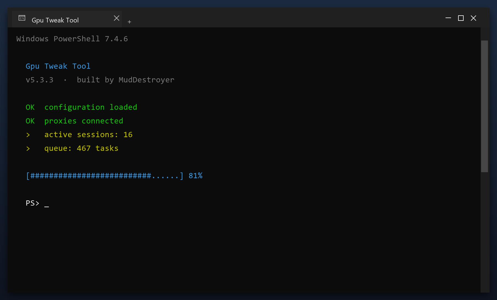

# Gpu Tweak Tool: Free Download and Guide (2026)

 

  

**Gpu tweak tool** is a Windows utility that keeps your PC clean and running fast. It is the current 2026 build, tested on Windows 10 and 11. **Free. No registration. No bundled adware.**

| | |
| --- | --- |
| **Program** | Gpu Tweak Tool |
| **Version** | Latest 2026 build |
| **Price** | Free |
| **Systems** | see requirements below |
| **Download** | Quick Start section below |

  

### Quick Start

1. **Download** and unzip the package
2. **Right-click** the program and choose Run as administrator
3. **Choose a scan type** (quick or deep)
4. **Wait** for the report
5. **Select** the items to remove and confirm

> **Note:** make sure your work is saved before a deep clean. The tool creates a restore point, but saving first is always wise.

### What It Does

Gpu tweak tool does three things: it finds junk files, it finds broken settings, and it removes them. That is the whole tool - no social features, no accounts, no ads. It runs as a normal Windows program and works fully offline after you download it.

| **Term** | **Meaning** |
| --- | --- |
| **Junk** | Files no program needs any more |
| **Broken entry** | A setting that points to nothing |
| **Cache** | Temporary data stored for speed |
| **Offline** | Works without an internet connection |

### Features

| **Feature** | **Details** |
| --- | --- |
| **Supported systems** | Windows 10 and 11 |
| **Scheduling** | Optional automatic scans |
| **Undo** | Restore point created first |
| **Interface** | Simple, plain English |
| **Safety** | Scanned and tested build |
| **Version** | Current 2026 release |

### Requirements

| **Component** | **Minimum** | **Notes** |
| --- | --- | --- |
| **Windows** | 10 (64-bit) | 11 fully supported |
| **RAM** | 2 GB | 4 GB for large scans |
| **Disk** | 100 MB | Plus space to clean |
| **Account** | Standard | Admin for full cleanup |

### FAQ

**Is gpu tweak tool free?**

Yes - the full version, no registration and no hidden payments.

**Is it safe?**

The build is scanned and tested. It creates a restore point before making changes.

**Does it work on Windows 11?**

Yes, and on Windows 10 (64-bit).

**Will it delete my files?**

No. It only removes temporary and leftover files, not your documents or photos.

**Do I need the internet?**

Only to download it. After that it works offline.

**Where do I download it?**

Use the green button in the Quick Start section above.

---

*ethereal-puma-652 · Updated 2026-10-10 · Shared under the MIT License*
